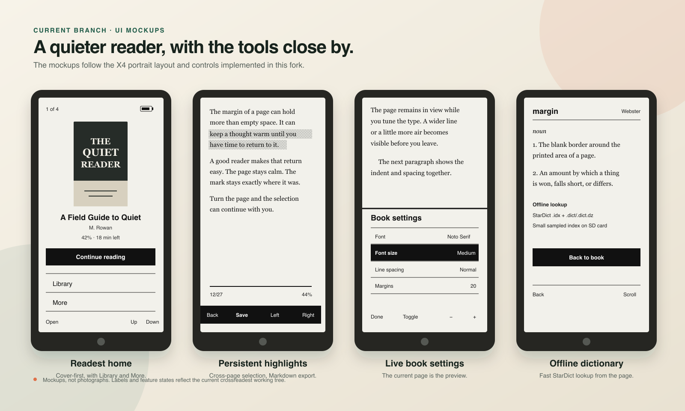

# CrossPoint Readest

Book-first firmware for the Xteink X3 and X4, built on [CrossPoint Reader](https://github.com/crosspoint-reader/crosspoint-reader).

[](#what-is-new)
[](#install)
[](LICENSE)
[](https://github.com/crosspoint-reader/crosspoint-reader)

CrossPoint Readest keeps the small, open CrossPoint foundation and sands down the parts you touch while reading. The home screen starts with your book. The page carries less chrome. Dictionary, highlighting, and typography controls stay close enough to use without turning the device into a dashboard.

It also pairs with the [`crossreadest` Readest desktop fork](https://github.com/kat3samsin/readest/tree/crossreadest) for local EPUB transfer and reading-position sync.


[What is new](#what-is-new) · [Mockups](#mockups) · [Use the reader tools](#use-the-reader-tools) · [Pair with Readest](#pair-with-readest) · [Install](#install) · [Build](#build-from-source)

## What is new

### A cover-first Readest theme

- A centered recent-book cover, title, author, progress, and time-left estimate.
- Two quiet home actions: **Library** and **More**.
- A slim reader footer with chapter page count, percentage, and session marker.
- Book-cover sleep screen by default, with Readest light and dark fallbacks.
- A Readest preset with book-style alignment, 20 px margins, first-line indents, and reduced status-bar clutter.

### Highlights that stay on the page

- Start selection from the current word, move with Left and Right, then save.
- Continue a selection onto the next page.
- Reopen the EPUB or change its typography without losing the visible marker.
- Save a readable clipping to `/Highlights/<book>.md` or one shared `/Highlights.md`.
- Move the cursor onto a saved passage and press **Delete** to remove the in-book highlight.

Markdown clipping files are append-only. Deleting the visible highlight does not rewrite an older clipping entry.

### Offline dictionary lookup

- Read StarDict `.idx` plus `.dict` or `.dict.dz` dictionaries from the SD card.
- Select the active dictionary under **Settings → Reader → Dictionary**.
- Build a small sampled `.qidx` sidecar on first use, then reuse it for faster lookups.
- Look up the selected word without leaving the book.

See [Dictionary setup](./docs/dictionary.md) for the SD-card layout and controls.

### Book settings with the real page as preview

The upper half keeps text from the current page visible. The lower half changes:

- Font
- Font size
- Line spacing
- Paragraph spacing
- Margins
- Alignment

Up and Down move through rows. Left and Right change the value. The preview reuses the rendered page text and prewarms the selected font, avoiding another chapter read or repagination when the sheet opens.

### A dedicated Readest bridge

- Advertises book and reading-progress capabilities to the matching desktop fork.
- Receives missing EPUBs over the device's WebDAV server.
- Keeps a manifest boundary around Readest-managed books.
- Adopts an identical EPUB already on the SD card instead of uploading a duplicate.
- Exchanges stable reading positions through atomic sidecar files.

Book transfer and reading-position sync are separate steps in the bridge. Highlight sync with desktop Readest is still design-only and remains disabled in the advertised capability set.

## Mockups



These are UI mockups based on the current `crossreadest` working tree. The device photo above is an actual Xteink reader.

## Feature status

| Area | Current state |
| --- | --- |
| Readest theme and home | Shipped |
| Reader footer and cover sleep screen | Shipped |
| Offline StarDict lookup | Shipped |
| Persistent and cross-page highlights | Shipped |
| Markdown highlight clippings | Shipped |
| Live current-page settings preview | Shipped |
| Readest EPUB transfer | Shipped |
| Readest reading-position sync | Shipped |
| Readest bookmark and highlight sync | Design only |

## Use the reader tools

### Highlight a passage

1. Open **Settings → Controls → Long-press Menu**.
2. Choose **Highlight** or **Dictionary + Highlight**.
3. Open an EPUB and hold **Confirm** for about 0.4 seconds.
4. Move with **Left** and **Right**.
5. Press **Confirm** once to set the start, then again to save the end.

In **Dictionary + Highlight** mode, a short Confirm press handles highlighting and a held press looks up the selected word.

### Delete a highlight

1. Start Highlight or Dictionary + Highlight selection.
2. Move onto any word inside the saved passage.
3. Press **Confirm** when the control changes to **Delete**.

### Change book typography

1. Short-press **Confirm** from the reading page.
2. Open **Book settings**.
3. Use **Up** and **Down** to select a row.
4. Use **Left** and **Right** to see the setting on the current-page preview.
5. Press **Done** to return to the book.

## Pair with Readest

You need this firmware and the [`crossreadest` Readest desktop branch](https://github.com/kat3samsin/readest/tree/crossreadest).

1. On CrossPoint, open **File Transfer → Join Network**.
2. Keep the reader and computer on the same trusted Wi-Fi network.
3. In Readest desktop, open **Settings → Integrations → CrossPoint**.
4. Enter the reader's IP address and select **Connect** or **Test connection**.
5. Select **Sync books**.
6. Open the matching EPUB on either side before judging its reading position.

The current CrossPoint server has no authentication. Use this integration only on a trusted local network.

## Everything inherited from CrossPoint

This fork retains the wider CrossPoint reader underneath the new surface:

- EPUB 2/3, XTC/XTCH, TXT, and BMP reading
- OPDS browsing and downloads
- Web file transfer and WebDAV
- KOReader-compatible progress sync
- Bookmarks, footnotes, custom SD-card fonts, focus reading, and auto page turn
- Calibre wireless connection
- Multiple UI languages and RTL support
- Classic, Lyra, Lyra Extended, and RoundedRaff themes

The [upstream README](https://github.com/crosspoint-reader/crosspoint-reader#readme) and this fork's [User Guide](./USER_GUIDE.md) cover the full feature set.

## Install

This is custom firmware. Keep a copy of the official firmware before flashing and use a USB-C data cable.

### Flash a built `firmware.bin`

1. Connect and wake the X3 or X4.
2. Open the [CrossPoint flash tools](https://crosspointreader.com/#flash-tools) in a Chromium-based browser.
3. Select the correct device.
4. Choose **Custom .bin** and select this fork's `firmware.bin`.

Flashing firmware does not normally erase settings stored on the SD card under `/.crosspoint/`. An explicit erase or factory reset is different.

### USB-locked devices

Some third-party Xteink units ship with USB flashing locked. Read the [official unlocker guidance](https://crosspointreader.com/#unlock-tool) before using the tool. A unit bought directly from xteink.com normally does not need it.

## Build from source

### Prerequisites

- [pioarduino](https://github.com/pioarduino/pioarduino), or VS Code with the pioarduino extension
- Python 3.8+
- A USB-C data cable

```bash
git clone --recursive https://github.com/kat3samsin/crosspoint-reader.git
cd crosspoint-reader
git checkout crossreadest
git submodule update --init --recursive
pio run -e katre_fast
```

The firmware image is written to:

```text
.pio/build/katre_fast/firmware.bin
```

Flash directly from the command line:

```bash
pio run -e katre_fast -t upload --upload-port /dev/cu.usbmodem101
```

Adjust the port for your computer. Use the `default` environment when serial diagnostics are needed.

## SD-card data

CrossPoint keeps device state and generated data under `/.crosspoint/`. This fork adds Readest bridge files alongside the existing cache:

```text
.crosspoint/
├── epub_<hash>/
├── readest-library.json
├── readest-sync/
│   ├── <document>.readest.json
│   └── <document>.crosspoint.json
├── settings.json
├── state.json
└── recent.json
```

Highlights are stored separately in device-managed range data and exported as readable Markdown under `/Highlights/` or `/Highlights.md`.

## Documentation

- [User Guide](./USER_GUIDE.md)
- [Dictionary and highlights](./docs/dictionary.md)
- [Web server usage](./docs/webserver.md)
- [Web server endpoints](./docs/webserver-endpoints.md)
- [File formats](./docs/file-formats.md)
- [Readest annotation sync contract](./docs/READEST_ANNOTATION_SYNC.md)
- [Project scope](./SCOPE.md)
- [Contributing](./docs/contributing/README.md)
- [Touch and UI development](./docs/contributing/touch-and-ui.md)

## Credits and license

CrossPoint Readest is a community fork of [CrossPoint Reader](https://github.com/crosspoint-reader/crosspoint-reader). The hardware support, EPUB engine, networking, caching, translations, and most of the reader remain the work of the upstream CrossPoint contributors.

Contributions should keep the firmware's ESP32-C3 memory limits in mind and preserve compatibility with the Xteink X3 and X4.

Licensed under the [MIT License](./LICENSE), following the upstream project.
